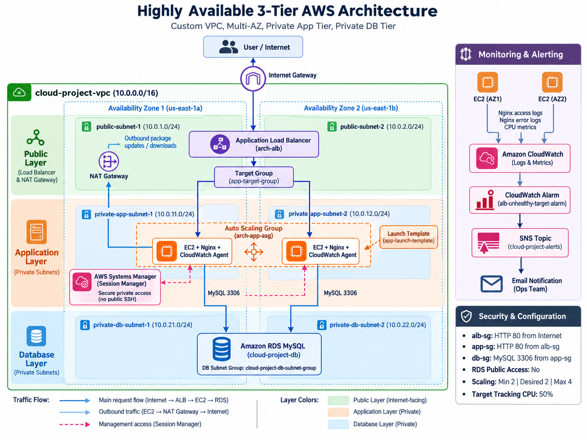

# Highly Available 3-Tier AWS Architecture

A hands-on AWS project demonstrating a secure, scalable, and monitored 3-tier cloud architecture using a custom VPC, Application Load Balancer, Auto Scaling EC2 instances, private RDS MySQL, CloudWatch, SNS, and Systems Manager.

## Architecture



### Request Flow

```text
User / Internet
       |
       v
Internet Gateway
       |
       v
Application Load Balancer
       |
       v
Target Group
       |
       v
Private EC2 Instances
       |
       v
Amazon RDS MySQL
```

The Application Load Balancer is exposed to the internet, while the application servers and database remain inside private subnets.

---

## Architecture Overview

The custom VPC uses:

```text
VPC CIDR: 10.0.0.0/16
```

The architecture is divided into three layers:

| Layer | Resources |
|---|---|
| Public Layer | ALB, NAT Gateway |
| Application Layer | Auto Scaling EC2 instances |
| Database Layer | Amazon RDS MySQL |

The application tier is distributed across two Availability Zones.

---

## Network Design

### Public Subnets

```text
public-subnet-1    10.0.1.0/24
public-subnet-2    10.0.2.0/24
```

Used for:

- Application Load Balancer
- NAT Gateway

### Private Application Subnets

```text
private-app-subnet-1    10.0.11.0/24
private-app-subnet-2    10.0.12.0/24
```

Used for:

- EC2 application servers
- Auto Scaling Group

### Private Database Subnets

```text
private-db-subnet-1    10.0.21.0/24
private-db-subnet-2    10.0.22.0/24
```

Used by the RDS DB subnet group.

---

## AWS Services Used

- Amazon VPC
- EC2
- Application Load Balancer
- Target Groups
- Auto Scaling
- Launch Templates
- Amazon RDS MySQL
- Internet Gateway
- NAT Gateway
- Route Tables
- Security Groups
- IAM
- AWS Systems Manager Session Manager
- Amazon CloudWatch
- Amazon SNS

---

## Security Design

Security groups were configured using a layered approach:

```text
Internet
   |
   | HTTP 80
   v
alb-sg
   |
   | HTTP 80
   v
app-sg
   |
   | MySQL 3306
   v
db-sg
```

### ALB Security Group

```text
Inbound:
HTTP 80 from 0.0.0.0/0
```

### Application Security Group

```text
Inbound:
HTTP 80 from alb-sg
```

### Database Security Group

```text
Inbound:
MySQL 3306 from app-sg
```

The RDS instance has:

```text
Public Access: No
```

This prevents direct database access from the internet.

---

## Application Load Balancing

An internet-facing Application Load Balancer distributes incoming requests between EC2 instances running in private application subnets.

The ALB forwards traffic to:

```text
app-target-group
```

Only healthy targets receive traffic.

### Healthy Targets


---

## Auto Scaling

The application servers run inside an Auto Scaling Group.

Configuration:

```text
Minimum Capacity: 2
Desired Capacity: 2
Maximum Capacity: 4
```

A target-tracking policy was configured using:

```text
Average CPU Target: 50%
```

CPU load was generated using `stress-ng` to test automatic scaling.

The Auto Scaling Group successfully increased capacity when CPU utilization increased.

### Scaling Policy


### Scaling Activity


---

## EC2 Automation

EC2 instances are created using a Launch Template.

User data automatically:

- Installs Nginx
- Starts the Nginx service
- Creates the application landing page
- Installs the CloudWatch Agent
- Configures Nginx log collection
- Starts the CloudWatch Agent

This allows newly launched Auto Scaling instances to configure themselves automatically.

---

## Private RDS Database

Amazon RDS MySQL is deployed inside private database subnets.

Application servers connect to RDS using:

```text
TCP 3306
```

Connectivity was successfully tested from a private EC2 instance.

A test database and table were also created to verify read/write access.

### RDS Connectivity


---

## Secure EC2 Access

The EC2 instances do not require direct SSH access from the internet.

AWS Systems Manager Session Manager was configured using an IAM instance profile.

This allows administrative access without exposing:

```text
Port 22
Public EC2 IP addresses
SSH keys over the network
```

---

## Monitoring and Logging

Amazon CloudWatch is used for monitoring and centralized logging.

Nginx logs are automatically sent to:

```text
/cloud-project/nginx/access
/cloud-project/nginx/error
```

CloudWatch also monitors EC2 CPU utilization and Auto Scaling metrics.

### CloudWatch Logs


---

## CloudWatch Alarm and SNS

A CloudWatch alarm was configured to monitor unhealthy ALB targets.

```text
Alarm:
alb-unhealthy-target-alarm
```

When the alarm enters the ALARM state:

```text
CloudWatch Alarm
       |
       v
SNS Topic
       |
       v
Email Notification
```

### Monitoring Alarm


---

## VPC and Subnets

The architecture uses separate public, application, and database subnets to provide network isolation.

### Subnet Configuration


---

## Key Features

- Custom VPC design
- Multi-AZ application architecture
- Public and private subnet isolation
- Application Load Balancing
- CPU-based Auto Scaling
- Private EC2 instances
- Private RDS MySQL database
- NAT Gateway for outbound private-subnet internet access
- Security-group chaining
- Automated EC2 configuration using Launch Templates
- Systems Manager Session Manager
- Centralized Nginx logging
- CloudWatch monitoring
- SNS email alerts

---

## What I Learned

This project provided hands-on experience with:

- Designing AWS network architecture
- CIDR and subnet planning
- Public vs private subnet routing
- Internet Gateway and NAT Gateway
- Security groups
- Load balancing
- Auto Scaling
- Private database connectivity
- IAM roles
- Systems Manager
- CloudWatch metrics and logs
- Infrastructure automation
- AWS monitoring and alerting

---

## Repository Structure

```text
aws-three-tier-architecture/
│
├── README.md
│
├── architecture/
│   └── architecture-diagram.png
│
└── screenshots/
    ├── vpc/
    ├── alb/
    ├── asg/
    ├── ec2/
    ├── rds/
    └── cloudwatch/
```

---

## Project Status

✅ Architecture deployed and tested  
✅ ALB routing verified  
✅ EC2 targets healthy  
✅ Auto Scaling tested under CPU load  
✅ Private EC2-to-RDS connectivity verified  
✅ CloudWatch logging verified  
✅ SNS notifications configured  

---

## Important Note

This project was created for learning and portfolio purposes. Cost-generating resources such as NAT Gateway, Application Load Balancer, EC2, and RDS were removed after testing.

No AWS credentials, passwords, access keys, or private keys are stored in this repository.
